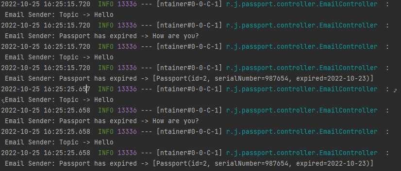

# Passport
### The service deals with passport management.

### Functionality:
* CRUD operations for passport
* Console UI
* Passport expiration date periodic check
* The service calls the methods of the first service using RestTemplate (synchronous messaging)
* Console mail service

### Assembly and installation:
1. Install Zookeeper и Kafka on your computer
2. Start Zookeeper и Kafka
```shell
mvn install -Dmaven.test.skip=true
java -jar target/job4j_passport-0.0.1-SNAPSHOT.jar
```

### TODO list
- /save, save passport details
- /update?id=*, update passport information
- /delete?id=*, delete passport data
- /find, download all passports
- /find?seria=*, upload passports with a given series
- /unavaliabe, upload passports whose expiration date has expired
- /find-replaceable, upload passports that need to be replaced within the next 3 months

### Used technologies:


### Screenshots


### Contact:
If you have any questions, feel free to contact me https://t.me/VadimDedeyko